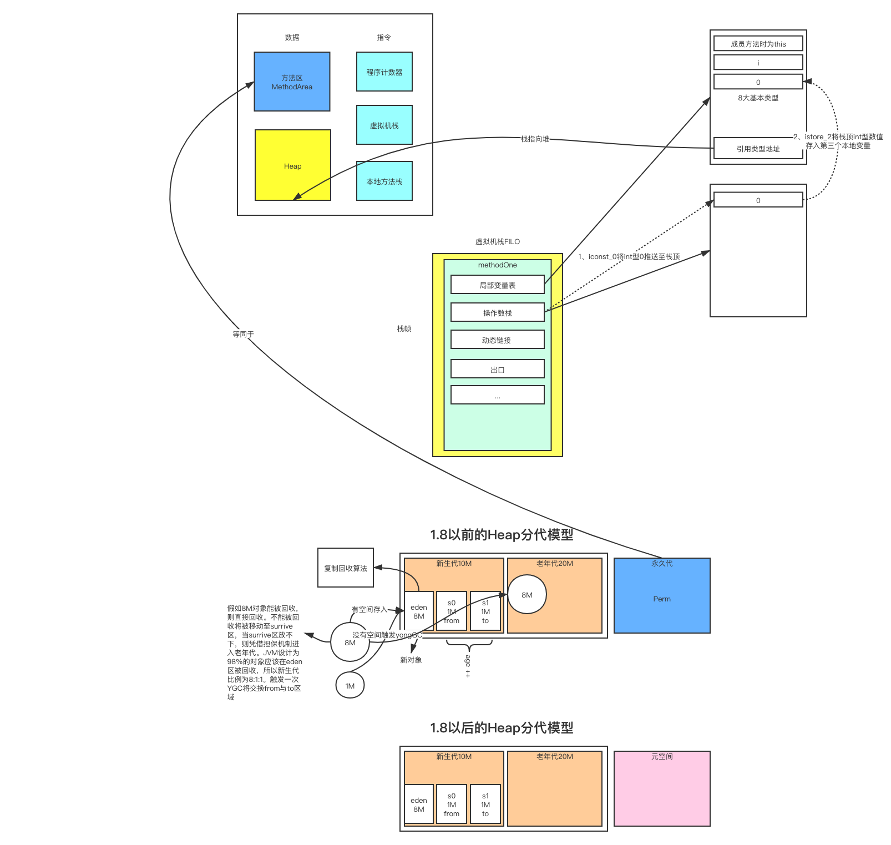

# JVM

## 1 JVM运行时数据区

计算机底层既数据的存取，指令的运算。所以JVM运行时数据区可以看做是操作系统底层的快照。

- 程序计数器：当前线程正在执行的字节码指令地址（行号），告诉当前线程要执行什么事情。
- 虚拟机栈：是一种数据结构，用来存储数据。存储当前线程运行方法时所需要的数据、指令、返回地址。
- 本地方法栈：存放native方法
- 方法区：存放类信息、常量（1.7+有变化）、静态变量、JIT（1.7以前）
- 堆内存：1.8之后永久代改为了元空间。对象数据主要在堆内存的新生代和老年代中存放，新生代又分为eden区与surrive区，surrive区分为from区与to区。它们三者的内存分配比例为8:1:1。所有的新对象都会首先试着放入eden区，当eden区装不下新对象时将触发YGC，将可回收的对象通过复制回收算法往surrive的from，to区放，如果surrive区放不下，则将放入老年代中。

## 2 GC算法

- 根可达算法（GC Root）：JVM会根据虚拟机栈中本地变量引用，方法区中静态变量引用对象、常量引用对象，本地方法栈中JNI引用对象来判断对象是否存在根引用，如果没有根引用，则对象可被回收。所以，判断对象是否能被回收的根本是看是否有根引用。但**无法解决对象相互循环引用**的问题。

  - **引用定义回收优先级**：

    1. 强引用，指向null时可被回收

    2. 软引用，内存不足时回收（缓存）

    3. 弱引用，下一次垃圾收集会回收掉，不管内存是否足够（针对大对象）

    4. 虚引用

       

       面试题：请用java实现一个缓存

       ​	思路：1、缓存--> 常驻内存的一块区间，那么就是用java在内存中开辟一块内存空间，该内存空间不会被随意回收

       ​               2、当整个堆内存空间不足时，能有丢弃机制，能够释放空间（被回收）

       ​    基于以上两点选型，软引用符合此种业务场景。

       

       面试题：Full GC5分钟一次，如何优化

       ​    思路：需要优化的是最大吞吐率还是最小执行时间？

       ​               最大吞吐率 = 代码执行时间 /（代码执行时间 + GC时间），假如270/(270 + 30 ) = 0.9 提升到0.95

       ​				1、首先确定垃圾回收器有没有选对（老年代的垃圾回收器）

       ​				2、再看jstack和GC日志查出为什么5分钟一次，5分钟在回收什么东西

       

       

- 标记清楚算法：算法分为“标记”和“清楚”两个阶段。首先标记出需要被回收的对象，在标记完成后统一回收掉所有的被标记对象。说它是最基础的算法，是因为后续的其他算法都是基于它的缺点进行改进而得到的。标记清楚算法的主要缺点有如下两个：

  - 效率问题
  - 空间问题，标记清楚后会产生很多不连续的内存碎片，当程序需要分配较大对象时无法找到足够的连续内存而不得不提前触发再一次的垃圾收集动作。

- 复制算法：

- 标记压缩算法：

- 分代收集算法：

  

## 3 垃圾收集器

- ### Serial串行收集器

  串行收集器是最古老，最稳定以及效率高的收集器，可能会产生较长的停顿，只使用一个线程去回收。

  新生代、老年代使用串行去回收。

  新生代复制算法、老年代“标记-压缩”。

  垃圾收集的过程中会服务暂停。

  参数控制：-XX:+UseSerialGC

- ### ParNew收集器

  串行收集器的多线程版本。

  新生代并行，老年代串行。

  新生代复制算法、老年代“标记-压缩”。

  参数控制：-XX:+UseParNewGC

  ​                  -XX:ParallelGCThreads 限制线程数

- ### Parallel收集器

  类似于ParNew收集器，Parallel收集器更关注与系统**吞吐量**。可通过参数来打开自适应调节策略，JVM会根据当前系统的运行情况收集性能监控信息，动态调整这些参数以提供最合适的停顿时间或最大吞吐量。也可以通过参数控制GC的时间不大于多少毫秒或者比例。

  新生代复制算法、老年代“标记-压缩”。

  参数控制：-XX:+UseParallelGC （使用Parallel收集器 + 老年代串行）

  

- ### Parallel Old收集器

  Parallel收集器老年代的版本，使用多线程和“标记-整理”算法。该收集器在jdk1.6开始提供。

  参数控制：-XX:+UseParallelOldGC（使用Parallel收集器 + 老年代并行）

- ### CMS收集器

  Concurrent Mark Sweep收集器是一种以获取最短回收停顿时间为目标的收集器。目前很大一部分Java应用都集中在互联网站或B/S系统的服务端上，这类应用尤其重视服务的响应速度，希望系统停顿时间最短，已给用户带来较好的体验。

  基于“标记-清除”算法实现，它的运作过程包含4个步骤：

  1. 初始标记（CMS initial mark）
  2. 并发标记（CMS concurrent mark）
  3. 重新标记（CMS remark）
  4. 并发清除（CMS concurrent sweep）

  其中初始标记和重新标记这两个步骤仍然需要产生停顿。

  初始标记仅仅是标记一下GC Roots能直接关联到的对象，速度很快。

  并发标记就是进行GC Roots Tracing的过程。

  重新标记则是为了修正并发标记期间，因用户程序继续运作而导致标记产生变动的那一部分对象标记记录，这个阶段停顿的时间一般会比初始标记阶段稍长一些，但远比并发标记的时间短。

  由于整个过程中耗时最长的并发标记和并发清除过程中，收集器线程都可以与用户线程一起工作，所以总体上来说，CMS收集器的内存回收过程是与用户线程一起并发地执行。

  新生代ParNew收集器，老年代CMS收集器。

  优点：并发收集、低停顿。

  缺点：产生大量空间碎片、并发阶段会降低吞吐量。

  参数控制：-XX:+UseConcMarkSweepGC

  ​                  -XX:+UseCMSCompactAtFullCollection Full GC后，进行一次碎片整理；整理过程是独占的，会引起停顿时间过长

  ​				  -XX:+CMSFullGCsBeforeCompaction 设置进行几次Full GC后，进行一次碎片整理

  ​                  -XX:+ParallelCMSThreads 设定CMS线程数量（一般约等于可用CPU数量）。

- ### G1收集器

  是目前技术发展的最前沿成果之一。HotSpot团队赋予它的使命是在未来替换掉CMS收集器。与CMS收集器相比G1收集器有以下特点：

  1. 空间整合，G1收集器采用“标记-整理”算法，不会产生内存空间碎片。分配大对象时不会因为无法找到连续的空间而触发再一次的GC。
  2. 可预测停顿，建立可预测的停顿时间模型，能让使用者明确指定一个长度为N毫秒的时间片段内，消耗垃圾收集上的时间不得超过N毫秒。

  G1收集器与其他收集器不同的地方在于，其他收集器都是作用于新生代或老年代。而G1是将整个堆内存划分为多个大小相等的独立区域，虽然还保留有新生代和老年代的概念，但不再是物理隔阂，都是一部分（可以不连续）区域集合。

  G1收集器收集步骤：

  1. 标记阶段

     首先初始标记这个阶段是停顿的，并且会触发一次YGC。对应GC log：GC pause（yong）（inital-mark）

  2. Root Region Scanning

     程序运行过程中会回收surrive区，这一过程必须在YGC之前完成。

  3. Concurrent Marking

     在整个堆中进行并发标记（和应用程序并发执行），此过程可能被YGC中断。若发现区域对象中的所有对象都是垃圾，那这个区域会被立即回收。同时，并发标记过程中，会计算每个区域的对象活性（区域中存活的对象比例）。

  4. Remark

     再标记会出现短暂的停顿。再标记阶段是用来手机并发标记阶段产生新的垃圾（并发阶段和应用程序一同运行）。G1中采用了比CMS更快的初始快照算法：snapshot-at-the-begging（SATB）。

  5. Copy/Clean Up

     多线程清除失活对象，会有停顿。G1将回收区域的存货对象拷贝到新区域，清除Remember Sets，并发清空回收区域并把它返回到空闲区域链表中

  

  ## 4 常用的收集器组合

  

  |      | 新生代GC策略      | 老年代GC策略   | 说明                                                         |
  | :--: | ----------------- | -------------- | ------------------------------------------------------------ |
  |  1   | Serial            | Serial Old     | Serial和Serial Old都是单线程进行GC，特点就是GC时暂停所有应用线程 |
  |  2   | Serial            | CMS+Serial Old | CMS是并发GC，实现GC线程和应用线程并发工作，不需要暂停所有应用线程。另外，当CMS进行GC失败时，会自动使用Serial Old策略进行GC |
  |  3   | ParNew            | CMS            | ParNew是Serial的并行版本，可指定GC线程数，默认GC线程数为CPU数量 |
  |  4   | ParNew            | Serial Old     | 新生代使用ParNew GC策略，年老代默认使用Serial Old GC策略     |
  |  5   | Parallel Scavenge | Serial Old     | Parallel Scavenge主要关注一个可空的吞吐量：T / （T + GC），这会使CPU利用率尽可能高。适用于后台持久运行的应用程序，而不适用于交互较多的应用程序 |
  |  6   | Parallel Scavenge | Parallel Old   | Parallel Old是Serial Old的并行版本                           |
  |  7   | G1                | G1             | -XX:+UnlockExperimentalVMOptions -XX:+UseG1GC    #开启 -XX:MaxGCPauseMillis =50         #暂停时间目标 -XX:GCPauseIntervalMillis =200     #暂停间隔目标 -XX:+G1YoungGenSize=512m      #年轻代大小 -XX:SurvivorRatio=6              #幸存区比例 |

  