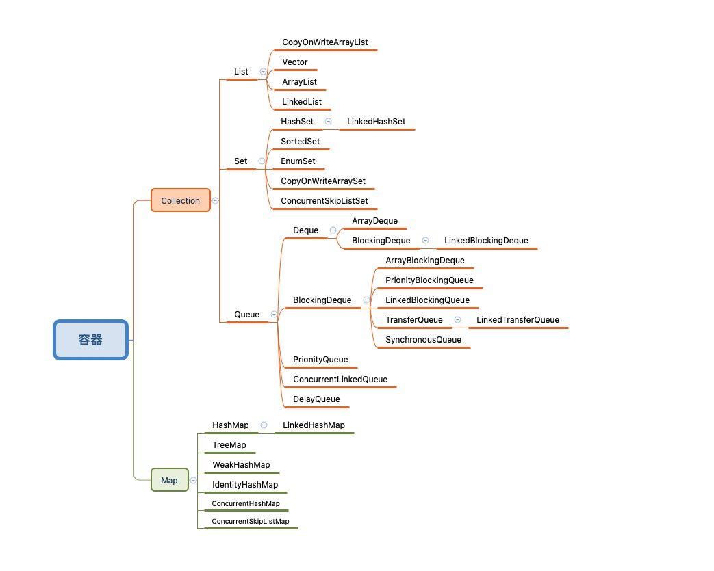
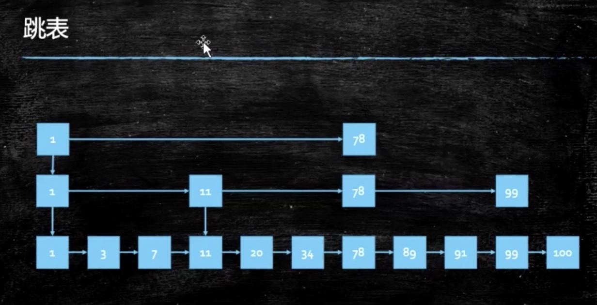

# 并发基础

## 1 线程

### 1.1 基础

什么是线程

​    进程表示程序在操作系统中的运行态，而线程是进程中运行的最小单位。

如何创建线程

​    继承`Thread`类重写`run`方法

​    实现`Runnable`接口实现`run`方法

怎样启动线程

​    Thread.start()

​    Executors.newCachedThread()

线程方法

   `sleep()`当前线程进入睡眠，让出cpu资源，sleep完回到就绪（ready）状态

   `yield()`暂时退出，让出一下cpu资源，其他线程能否抢到，不管。

   `join()`当前线程加入另一个线程，当另一个线程执行完成时才继续运行当前线程。

线程状态

​	runnable：ready，running

​	time-waiting

​    waiting

​    blocked

​	terminated

关闭线程

   正常让线程结束，不要stop()线程,interrupt()打断线程来处理逻辑也是不合理的

## 2 synchronized

### 2.1 基础

```java
private Object o = new Object();
public void m(){
  synchronized(o){
    //do something
  }
}
```

1.1 `synchronized`在对象上进行加锁，对象头（64位）里面拿出两位来来记录是否被锁定（mark word），基础数据类型以及`String`不建议用来做对象锁。

用来加锁的对象o改变了，则锁失效，所以对象锁一般都需要加`final`。

```java
public synchronized void m1(){
  
}

public void m2(){
  synchronized(this){
    
  }
}
```

1.2 上面两种方式为等价方式，都是基于`this`对象进行加锁


```java
public class T1{
	public synchronized static void m1(){
  
	}

	public void m2(){
  	synchronized(T1.class){
      
    }
	}
}
```

1.3 静态方法使用`synchronized`等同于使用class对象进行加锁，在同一个ClassLoader中，class对象在内存中为单例。

1.4 在`synchronized`块中所涉及的全局变量不必再使用`volatile`关键字修饰，因为`synchronized`既保证了可见性又保证了原子性。

同步方法和非同步方法是必须可同时调用的，同时`synchronized`必须是可重入锁。


### 2.2 底层实现

JDK早期的实现为重量级，需要到操作系统去申请锁资源。

JDK1.5后，进行了改进，采用了“锁升级”的概念。

锁升级:

```java
private Object o = new Object();

public void m(){
  synchronized(o){
    
  }
}
```

​         

1.markword记录当前访问线程id，并不会去加锁--偏向锁

2.如果有其他线程争用，升级为自旋锁，争用线程占用cpu资源while循环等待，默认while10次（用户态）

3.如果还没得到锁，升级为重量级锁，加入到操作系统的等待队列（内核态）

**所以，执行时间长的或并发数高的使用系统重量级锁（synchronized）；执行时间短或线程数较少使用自旋锁。**


## 3 volatile

### 3.1 基础  

保证线程可见性 ， 基于MESI，CPU缓存一致性协议

禁止指令（汇编指令 ）重排序,CPU原语支持，loadFence ， storeFence 读写屏障：

比如new对象过程

1.申请内存 ， 赋上默认值

2.改为真正的值

3.内存指向赋值 

超高并发下，有可能重排序，则其他线程读到的值为初始化的默认值

volatile不能替代synchronized，应为它并不保证原子性。


## 4 CAS（无锁优化 自旋）

### 4.1 基础

Compare And Set，比较并且设定，基于Unsafe类（Unsafe类似于c++的指针）

Unsafe类主要提供以下几个操作：

​    直接操作内存

​    直接生成实例

​    直接操作类或实例变量

​    CAS相关操作

cas(V , Expected , NewValue){  //V要改的值 ， Expected期望的值 ， 新值

​	if (V == E){ //cpu 原语支持，这个过程不会被打断，所以不存在另一线程将V的值改变

​		V = NewValue

​    }else{

​        //try again or fail

​    }

ABA问题：

a = 1; cas(a , 1 , 2);

如果有其他线程将a变为2又变回为1，就会存在ABA问题，

此时需要加版本号来区分，在比较的时候连版本号一并检查

如果是基础类型，无所谓，引用类型会出现问题


### 4.2 LongAddr

分段锁，按线程数量分配数组元素，假如1000个线程，分成长度为4的数组，每个元素处理250个线程，最后再统一累加。

所以Atomic效率高于synchronized是应为运用了CAS无锁概念，而LongAddr在高并发下效率高于Atomic是使用了分段锁。


### 4.3 ReentrantLock

基于CAS原理的可重入锁，可以替代synchronized，比synchronized强大在于

​    可使用tryLock()进行尝试锁定,不管锁定与否，方法都将继续执行

​    可根据tryLock()返回值来判定是否锁定

​    也可以指定tryLock()时间，注意unlock

​    可以处理打断时候的情况

​    支持公平锁与非公平锁

### 4.4 ReadWriteLock

读写锁，读锁：共享锁；写锁：排他锁

提升读的效率，如果读的时候不加锁则出现脏读。


## 5 Lock底层实现AQS

### 5.1设计模式

模板模式（回调）

### 5.2实现步骤

Sync//同步器

NonFailSync//非公平同步器

FailSync//公平同步器


acquire() -> tryAcquire() -> nonfailTryAcquire() (failTryAcquire())


nonfailTryAcquire:

getState() -> volatile int , AQS的核心，state代表了加锁和解锁，为1时表示当前线程获得了锁，为0时表示释放了锁。根据子类不同的实现state实现不同的意义，比如CountDownLatch的state就是门栓拴住的个数。

AQS内部双向链表队列，这个队列装的是线程，这个队列用于监控state，当线程没有抢到锁，则进入队列进行等待。


JDK 1.9引入VarHadle ， 它是支持普通属性进行CAS原子操作的；直接操作二进制码比反射效率高。

## 6 ThreadLocal

线程副本，通过其内部类ThreadLocalMap存储数据，ThreadLocalMap的Entry为JVM弱类型引用继承了WeakReference类

ThreadLocal设置ThreadLocalMap的key为null时有内存泄露的风险，所以需要调用remove();将ThreadLocalMap的数据删除掉。

JVM引用分为：

强；软；弱；虚四种

强引用：Object o = new Object(); ， o设置为null时才会被gc回收

软引用：当系统堆内存不够用时才会回收

弱引用：只要遭到gc就会被回收,作用在于，如果有一个强引用在引用，当强引用消失则应该立即回收它，一般运用在容器里


虚引用：写虚拟机的人管理堆外内存用的,通过引用队列表示已被回收，则可以通知操作系统回收虚拟机外的的内存。


## 7 从并发角度看容器



### 7.1 Map并发效率

​    Hastable并发插入数据时效率不比SynchronizedMap以及ConcurrentHasMap低，此时体现出了synchronized效率优于CAS的特性。

在并发查询时ConcurrentHasMap的效率大大优于Hashtable等运用synchronized加锁的容器，基于Unsafe类的getObjectVolatile方法。

### 7.2 优先级队列



DelayQueue按时间排序队列，一般用来进行时间任务调度使用，基于PriorityQueue优先级队列实现。

PriorityQueue优先级队列采用二叉树结构，运用“跳表”的概念，减低链表检索次数。

### 7.3 总结

Vector，Hashtable 自带锁，基本不用。

Queue与List区别

Queue添加了对线程友好的API，包括offer(), peek(), poll()

BlockingQueue在Queue的基础之上添加了put() , take() 阻塞行为，是MQ的基础，典型的生产者与消费者


## 8 线程池

如果线程池中线程的数量过多，最终它们会竞争稀缺的处理器和内存资源，浪费大量的时间在上下文切换上。反之，如果线程的数目过少，处理器的一些核可能就无法充分利用。线程池大小与处理器的利用率之比可以使用下面的公式进行估算：

线程数=CPU核数 x 期望的CPU利用率(该值应该介于0和1之间) x (1 + 等待时间与计算时间的比率)